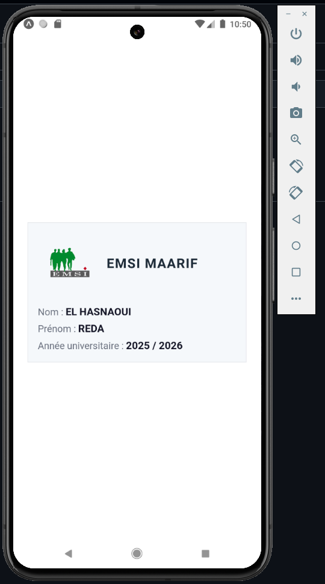

# carte-etudiant
TP React Native : Ma Première Carte d’Étudiant avec Expo.
Objectif : Créer une application mobile simple avec React Native + Expo qui affiche une carte 
d’étudiant avec : 
# Le logo de l’école 
# Les informations de l’étudiant (nom, prénom, ID, date de naissance…) 
# Une interface moderne et responsive 

